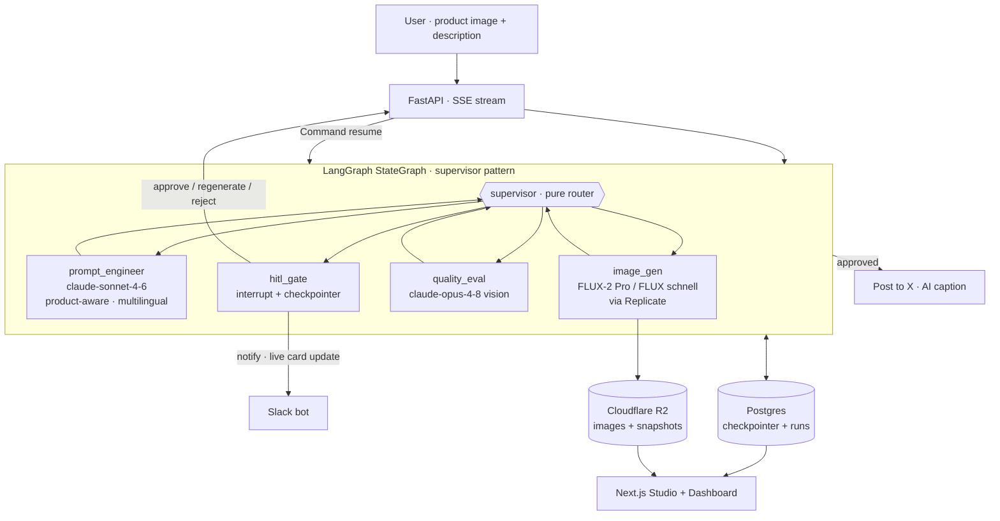

# AI Content Production Agent

Turn a **product photo + description** into an **ad‑ready creative**, get a human to
approve it in‑app or from Slack, and **post it to X** — orchestrated end‑to‑end by a
LangGraph multi‑agent system.

> 제품 이미지와 설명을 받아 광고용 크리에이티브를 생성하고, 사람이 승인한 뒤 X에 게시하는
> LangGraph 멀티 에이전트 시스템입니다. 다국어 브리프(한국어 → 영어 번역)와 제품 인지형
> 장면 구성, Postgres 기반 durable HITL을 지원합니다.

**Live:** Studio (Vercel) · API (Railway) · runs persisted in Postgres + Cloudflare R2

---

## What it does

- **Ad mode** — upload a product image + description → the creative director builds a
  product‑aware scene (e.g. sunscreen → sunlit), translates non‑English briefs to
  English, and renders **3 distinct style variations** for a human to pick.
- **Text mode** — a plain brief → prompt → image → auto‑score → retry loop.
- **Human‑in‑the‑loop** — graph pauses on `interrupt()`; reviewer approves / regenerates
  / rejects in the Studio **or** from a Slack card (which updates live on decision).
- **Publish** — approved creative posts to **X** with an AI‑generated caption.
- **Durable** — every run survives restarts via a Postgres checkpointer + run store;
  the **Dashboard** is a content‑forward gallery of all runs.

---

## Architecture



### Routing

```
ad mode    → generate 3 style variations → hitl_gate (human picks)
text mode  → score >= 8                  → hitl_gate
             score < 8 & iter < 3         → prompt_engineer (retry w/ critique)
             iter >= 3                    → hitl_gate (force decision)
```

---

## Tech stack

| Layer | Tech |
|---|---|
| Orchestration | LangGraph `StateGraph` (supervisor + conditional edges + native `interrupt()`) |
| LLMs | `claude-sonnet-4-6` (prompt + caption) · `claude-opus-4-8` (vision scoring) |
| Image gen | `flux-2-pro` (ads, reference‑image editing) · `flux-schnell` (text) via Replicate |
| Durability | Postgres — `AsyncPostgresSaver` checkpointer + `runs` table (JSONB) |
| Storage | Cloudflare R2 (S3‑compatible) for images + JSON snapshot fallback |
| HITL | Slack bot (`chat.postMessage` / `chat.update`, signature‑verified) |
| Publish | X / Twitter API (tweepy OAuth 1.0a media upload + v2 create_tweet) |
| API | FastAPI + SSE (`EventSourceResponse`, `graph.astream`) |
| Frontend | Next.js 15 (App Router) + Tailwind — Studio + Dashboard, generation survives navigation |
| Deploy | Railway (backend) + Vercel (frontend) — both auto‑deploy on `git push` |

---

## Project structure

```
backend/
├── main.py                 # FastAPI: /api/generate, /api/approve, /api/runs, /api/session …
├── graph.py                # build_graph(checkpointer) — StateGraph wiring
├── state.py                # GraphState (mode · product_image_url · brief · history)
├── db.py                   # Postgres run store (upsert/get/list)
├── agents/
│   ├── supervisor.py       # pure router (ad → 3 variations · text → retry loop)
│   ├── prompt_engineer.py  # product-aware, multilingual ad scenes (3 styles)
│   ├── image_gen.py        # Replicate calls + history
│   ├── quality_eval.py     # vision scoring (ignores text/labels)
│   └── hitl.py             # interrupt() + Slack notify
└── tools/
    ├── replicate_tool.py   # flux-2-pro (ads) · flux-schnell (text)
    ├── claude_vision_tool.py
    ├── slack_tool.py       # bot-token cards, live update on decision
    ├── x_tool.py           # post creative + caption to X
    └── r2_tool.py          # image + snapshot storage
frontend/app/
├── generation-context.tsx  # generation engine lifted to layout (survives nav) + toast
├── page.tsx                # Studio: upload, live SSE, variation picker, HITL
└── dashboard/page.tsx      # durable gallery: stats, filters, open a run
```

---

## Setup

### Backend
```bash
cd backend
python -m venv .venv && .venv\Scripts\activate   # macOS/Linux: source .venv/bin/activate
pip install -r requirements.txt
cp .env.example .env        # fill in keys
uvicorn main:app --reload   # → http://localhost:8000/docs
```

### Frontend
```bash
cd frontend
npm install
npm run dev                 # → http://localhost:3000
```

### Environment

| Variable | Required | Purpose |
|---|---|---|
| `ANTHROPIC_API_KEY` | ✅ | prompt + vision LLMs |
| `REPLICATE_API_TOKEN` | ✅ | image generation |
| `DATABASE_URL` | — | Postgres durability (falls back to R2/in‑memory if unset) |
| `R2_*` (account/key/secret/bucket) | — | Cloudflare R2 image + snapshot storage |
| `SLACK_BOT_TOKEN` · `SLACK_SIGNING_SECRET` · `SLACK_CHANNEL` | — | HITL review card |
| `X_API_KEY` · `X_API_SECRET` · `X_ACCESS_TOKEN` · `X_ACCESS_SECRET` | — | post to X |
| `APP_URL` | — | deep link back into the Studio from Slack |

> Secrets live in `backend/.env` (git‑ignored). When `DATABASE_URL`/R2 are unset the app
> degrades gracefully to an in‑memory checkpointer.

---

## Flow

1. **Upload** product image + description → `/api/generate` opens an SSE stream.
2. **prompt_engineer** builds a product‑aware scene (translating Korean → English if
   needed) in **3 styles**: clean/minimal · premium/dramatic · authentic lifestyle.
3. **image_gen** renders each via `flux-2-pro`, preserving the real product (no added
   text/labels/duplicates).
4. **hitl_gate** pauses (`interrupt()`); a Slack card fires and the Studio shows the
   3 variations.
5. **Reviewer** picks one and approves → `/api/approve` resumes the graph
   (`Command(resume=…)`); the Slack card updates to “approved by …”.
6. **Publish** posts the approved creative to **X** with an AI‑generated caption.
7. **Run persisted** to Postgres (+ R2 snapshot) and shown in the **Dashboard**.

---

## Deploy

Both targets are GitHub‑connected — **`git push` auto‑deploys** Railway (backend, root
`backend/`) and Vercel (frontend, root `frontend/`). No manual `railway up` / `vercel deploy`.
